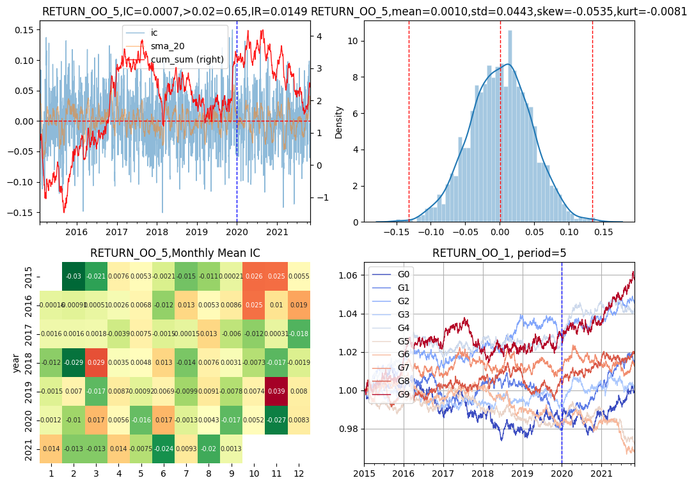
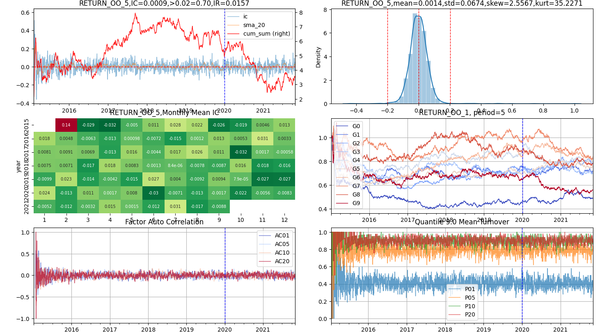
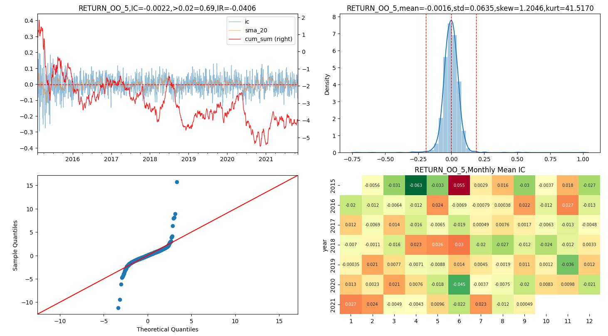
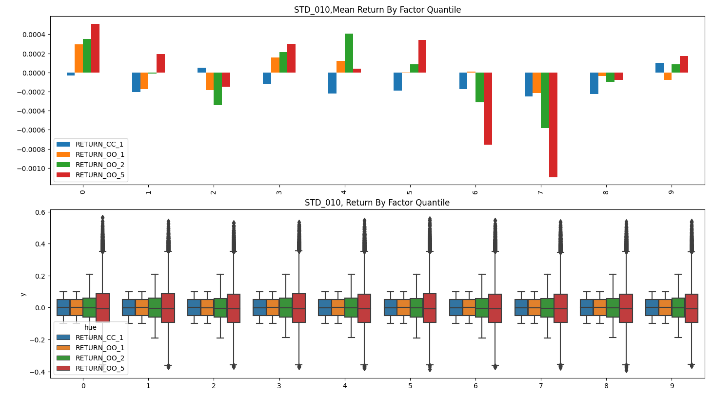
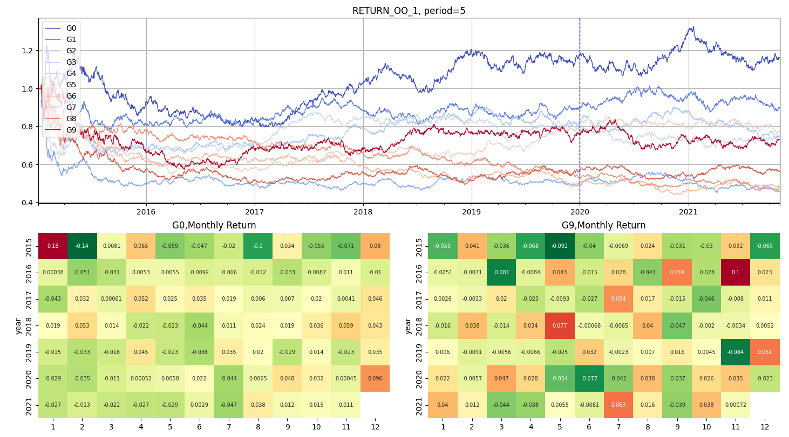
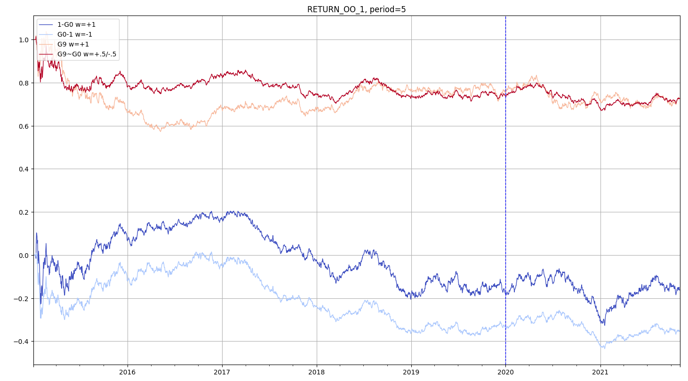
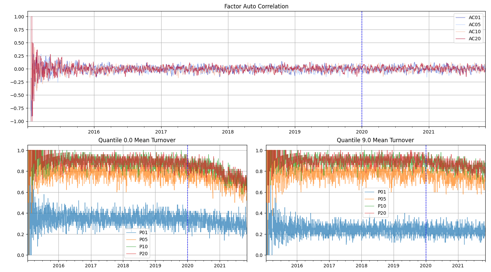
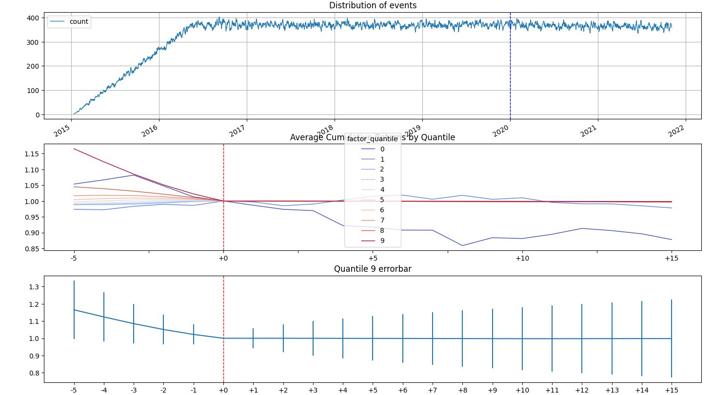

# AlphaInspect

仿`alphalens`的单因子分析工具

## 安装

```commandline
pip install -i https://pypi.org/simple --upgrade alphainspect  # 官方源
pip install -i https://pypi.tuna.tsinghua.edu.cn/simple --upgrade alphainspect  # 国内镜像源
```

## 使用

1. 准备数据。运行`data/prepare_data.py`
    1. date, asset。必需的两个字段
    2. factor因子值。放在因子发生时刻
    3. forward return远期收益率。计算收益率后需要回移到开始位置。为何是`shift(-n)收益率`，而不是`shift(n)因子`呢？
        1. 多期收期率。如果移动因子，会导致一个因子就要移动多次
        2. 因子一般成百上千，全移动要的工作量非常大，而收益率则少很多
    4. 推荐大家使用`expr_codegen`和`polars_ta`等项目
2. 运行`examples/demo1.py`示例弹出简易图表
3. 运行`examples/demo2.py`示例弹出完整图表
4. 运行`examples/demo3.py`示例多进程并行输出HTML网页报表
5. 运行`examples/demo4.py`示例事件图表

## 部分图示










## 累计收益的计算方法

参考 [cum_returns.md](cum_returns.md)

## `alphainspect`与`alphalens`的不同

1. 不自动计算`forward_returns`。
    1. `alphalens`设`periods=(1, 5, 10)`，然后内部计算持有1、5、10期数的收益率
    2. `alphainspect`由用户外部生成，用户可以比较同因子，不同交易方式产生的差异。例如：
        - `RETURN_OC_1`: T+1开盘入场，T+1收盘出场
        - `RETURN_CC_1`: T+0收盘入场，T+1收盘出场
        - `RETURN_OO_1`: T+1开盘入场，T+2开盘出场
        - `RETURN_OO_5`: T+1开盘入场，T+6开盘出场
2. 不做去极值、标准化、行业中性化等操作
    1. `alphalens`的各参数要弄懂还是很麻烦的，初学者如绩效达不到要求就得深入研究源代码找原因
    2. `alphainspect`用户在外可以一次性全计算好，如`F1_ORG, F1_ZS, F1_NEUT`，然后在分别传不同因子进行比较即可
3. 资金分配只用等权
    1. `alphalens`有因子加权、多空等设置
    2. `alphainspect`只提供等权一种计算方法，实现简单
4. 收益率计算方法不同
    1. `alphalens`多期简单收益率几何平均成1期，然后+1累乘
    2. ~~`alphainspect`由用户提供1期简单收益率，然后根据要求持有或调仓，得到新的权益，循环迭代下去。更精确~~
    3. `alphainspect`由用户提供每期收益率(也可以使用多期收益率的几何平均),然后累加。（分层计算速度提高1~1.5倍）

## `alphainspect`与`alphalens`的相同

1. 数据组织方式相同。都是长表，都是因子不移动，收益率计算，然后后移到与因子产生时间对齐
2. 不考虑滑点和手续费。单因子是用来合成多因子的，因手续费和滑点而错过部分单因子就可惜了，应当在因子合成后的回测阶段才考虑手续费
3. 收益计算不求精确，只为能正确评价因子绩效

## 二次开发

```commandline
git --clone https://github.com/wukan1986/alphainspect.git
cd alphainspect
pip install -e .
```
